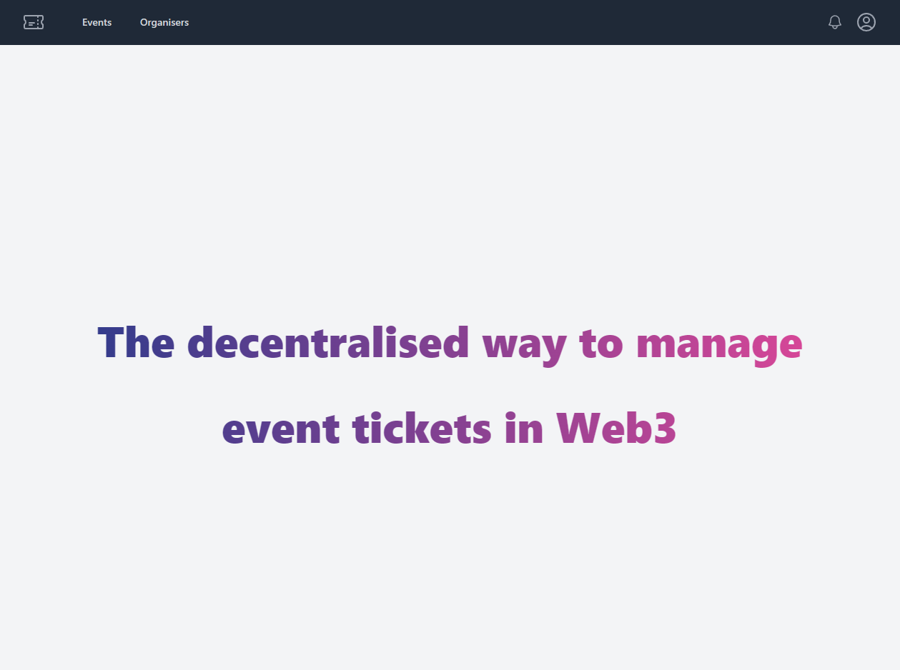

# Decentralized Ticket Sales

Allow [Organizers](backend/contracts/Organizer.sol) to set up [Events](backend/contracts/Event.sol) to sell [Tickets](backend/contracts/Ticket.sol) with the Ethereum blockchain with a static React/Next frontend.

Technologies involved:

- Backend: Solidity lang, OpenZeppelin, Truffle, Ethersjs
- Frontend: Reactjs, Nextjs, TailwindCSS, GitHub pages
- CICD: GitHub Actions



## Tests

1. Get to backend folder `cd backend`
2. Set test network in `truffle-config.js`
   ```json
   networks: {
       development: {
       host: "172.19.64.1", // Localhost (default: none)
       port: 7545, // Standard Ethereum port (default: none)
       network_id: "5777", // Any network (default: none)
       },
   ```
3. Launch tests with `truffle test`

## Frontend

Public frontend [link](https://flaprimo.github.io/blockchain-developer-bootcamp-final-project/).

1. Get to frontend folder `cd frontent`
2. Run frontend with `npm run dev`
